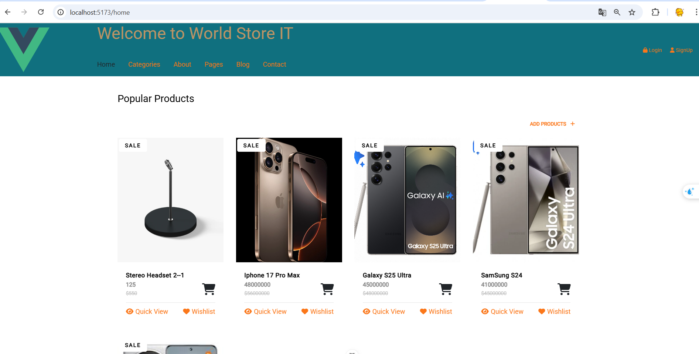
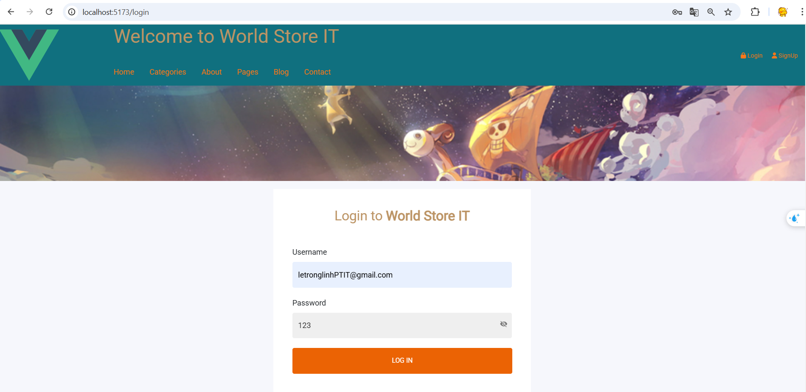
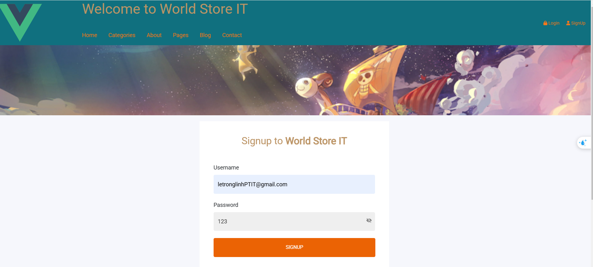
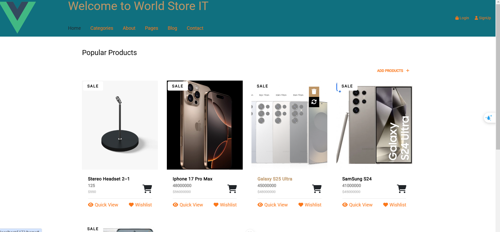
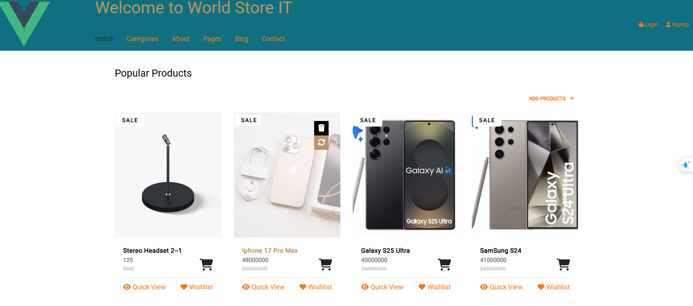
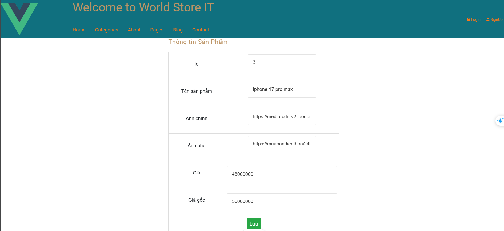
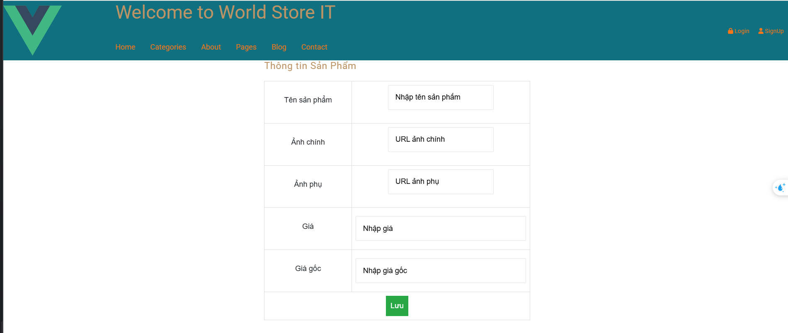

# world-store-it

## Các task
### 1. Lifecycle hooks
- beforeCreate()
- created()
- beforeMount()
- mounted()
- beforeUpdate()
- updated()
- beforeUnmount()
- unmounted()
- Demo các hàm trên tại LifeCycleView, tại url: localhost:5173/lifecycle
#### 1.1 Demo beforeCreate(), created(), beforeMount() và mounted()

#### 1.2 Demo beforeUpdate(), updated()

#### 1.3 Demo beforeUnmount(), unmounted()

## 2. CRUD
- Create: chức năng signup, tạo product
- Read: danh sách sản phẩm, login
- Update: Cập nhật product
- Delete: Xóa sản phẩm
### 2.1. Danh sách sản phẩm

### 2.2. Login

### 2.3. Signup

### 2.4. Xóa sản phẩm

### 2.5. Cập nhật product

### 2.6. Tạo sản phẩm

