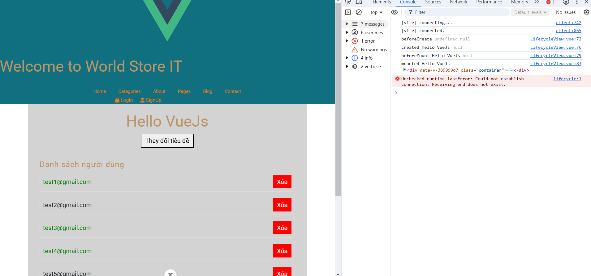
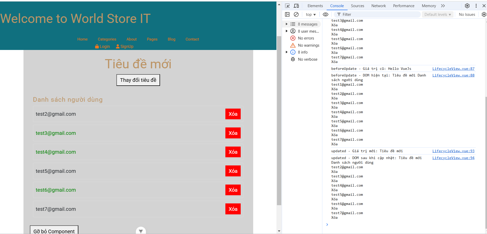
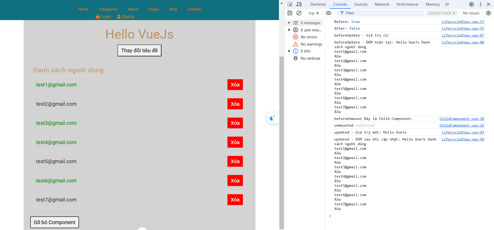

# world-store-it

## Các task
### 1. Lifecycle hooks
- beforeCreate()
- created()
- beforeMount()
- mounted()
- beforeUpdate()
- updated()
- beforeUnmount()
- unmounted()
- Demo các hàm trên tại LifeCycleView, tại url: localhost:5173/lifecycle
#### 1.1 Demo beforeCreate(), created(), beforeMount() và mounted()

#### 1.2 Demo beforeUpdate(), updated()

#### 1.3 Demo beforeUnmount(), unmounted()

## 2. CRUD
- Create: chức năng signup, create product
- Read: danh sách sản phẩm
- Update: Cập nhật user_info, update product
- Delete: Xóa sản phẩm